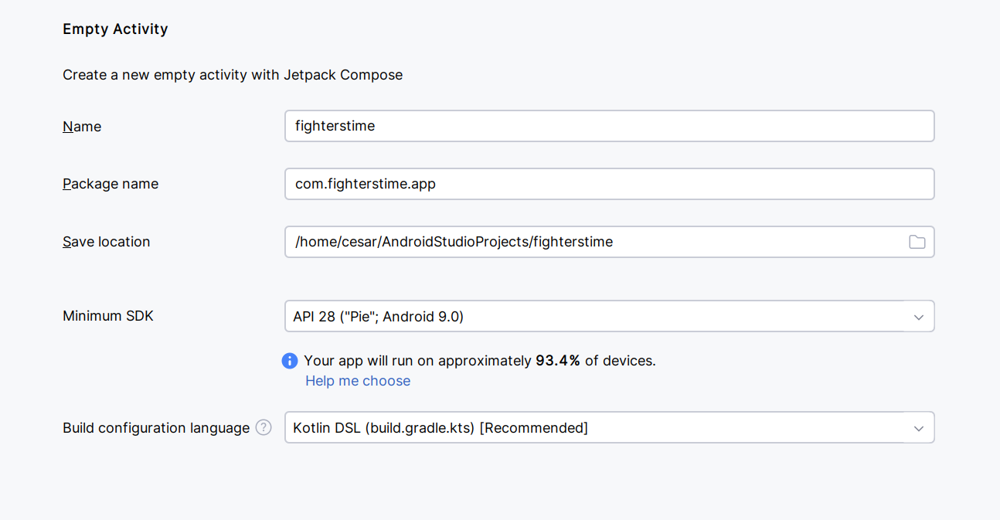

# Technical specifications - Especificaiones técnicas

## Configuración de Android Studio

Se utilizará "Pie" - Android 9.0

## Donde verificar la versión en la que se está trabajando actualmente 

## Actualización de funciones de Narwhal 3 | 2025.1.3	4.0-8.13

https://developer.android.com/studio/releases?hl=es-419#android_gradle_plugin_and_android_studio_compatibility
